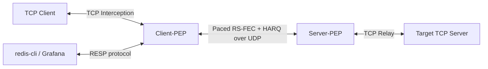

# TCP-PEP-GO: Adaptive FEC & Hybrid ARQ Accelerator for Ad-hoc Narrowband Networks

[](https://pkg.go.dev/github.com/sh0jitmy/tcp-pep-go)
[](https://github.com/sh0jitmy/tcp-pep-go/actions/workflows/test.yml)
[](https://goreportcard.com/report/github.com/sh0jitmy/tcp-pep-go)
[](https://opensource.org/licenses/Apache-2.0)

TCP-PEP-GO is a high-performance TCP Performance Enhancing Proxy (PEP) daemon written in Go, specifically optimized for high-packet-loss, high-latency, and narrowband wireless ad-hoc networks.

It features transparent TCP interception, Reed-Solomon Forward Error Correction (RS-FEC), Hybrid ARQ (NAK-based retransmission), dynamic adaptive parity sizing via Link Quality Reports (LQR), and a token-bucket traffic shaper customizable for different MAC layer architectures (CSMA, TDMA, WTRP).

## Key Features

1. **Sessionless UDP Encapsulation**: Intercepts TCP streams transparently and wraps them into structured UDP packets with low overhead.
2. **Adaptive Forward Error Correction (Adaptive FEC)**:
   - Encodes data blocks using Reed-Solomon erasure coding ($K$ data shards to $M$ parity shards).
   - Dynamically scales parity shards $M$ down to $0$ on clean links to completely eliminate overhead.
   - Automatically increases parity $M$ up to the maximum configuration limit when packet losses are detected.
3. **Hybrid ARQ (HARQ)**:
   - Instantly triggers target packet NAK retransmissions for missing sequence numbers before waiting for TCP timeouts.
4. **Token-Bucket Traffic Shaper**: Paces packet bursts to prevent congestion and queuing delays at the bottleneck radio link.
5. **Dynamic Routing Config & SIGHUP Reload**: Manages Client-to-Server PEP mappings via CIDR/subnets in a YAML file, with hot-reloading support upon SIGHUP.
6. **Built-in Redis Monitoring Server**: Embeds a Redis-protocol-compatible RESP server inside the daemon. You can query real-time stream status, parity size, and traffic stats using any standard Redis client (like `redis-cli`) without deploying an external database.

---

## Architecture Overview



---

## Installation & Build

### Prerequisites
- Go 1.25 or later

### Building the Daemon
Use the provided `Makefile` to build and test:

```bash
# Build the binary
make build

# Run unit and E2E integration tests
make test
```

### Static Analysis & Vulnerability Scan
```bash
# Run golangci-lint
make lintcheck

# Run govulncheck dependency vulnerability scans
make vulncheck
```

---

## Configuration

In client mode, the mapping of target TCP destinations to their corresponding Server-PEPs is defined in `routes.yaml`:

```yaml
routes:
  # Route specific host
  - original_dst: "192.168.1.100:80"
    server_pep: "10.0.0.2:20000"
  
  # Route subnet
  - original_dst: "172.16.0.0/16"
    server_pep: "10.0.0.3:20000"
```

To reload this routing table dynamically without stopping active proxy connections:
```bash
kill -HUP <PID_OF_TCP_PEP_DAEMON>
```

---

## Usage

### 1. Server-PEP Mode
Start the PEP daemon on the server side (near the target destination):
```bash
./tcp-pep-daemon \
  -mode server \
  -listen :20000 \
  -mtu 1200 \
  -bandwidth 128000 \
  -fec-k 5 \
  -fec-m 2
```

### 2. Client-PEP Mode
Start the PEP daemon on the client side (intercepting transparently redirected TCP traffic):
```bash
./tcp-pep-daemon \
  -mode client \
  -listen :10080 \
  -routes routes.yaml \
  -mtu 1200 \
  -bandwidth 128000 \
  -fec-k 5 \
  -fec-m 2 \
  -redis-addr :6379
```

---

## Real-time Monitoring via Built-in Redis Interface

The Client-PEP daemon spins up a lightweight embedded Redis-protocol compatible server (on port `:6379` by default or as configured via `-redis-addr`). 

You can query live session statistics, adaptive parity statuses, and network traffic volume directly using `redis-cli`:

### Querying active stream IDs
```bash
$ redis-cli SMEMBERS tcp-pep:active_streams
1) "1"
2) "2"
```

### Querying individual session statistics
```bash
$ redis-cli HGETALL tcp-pep:session:1
 1) "stream_id"
 2) "1"
 3) "mode"
 4) "client"
 5) "target_addr"
 6) "127.0.0.1:8080"
 7) "cur_m"               # Current adaptive parity size (M)
 8) "0"
 9) "fec_k"
10) "5"
11) "fec_m"
12) "2"
13) "tx_bytes"            # Accumulated transmitted bytes (UDP)
14) "109840"
15) "rx_bytes"            # Accumulated received bytes (UDP)
16) "109840"
17) "tx_packets"
18) "110"
19) "rx_packets"
20) "110"
21) "losses"              # Last reported packet loss count from LQR
22) "0"
23) "consecutive_ok"      # Consecutive error-free blocks
24) "12"
25) "last_active"
26) "2026-05-23T22:31:49Z"
```

### Checking server keys
```bash
$ redis-cli KEYS "*"
1) "tcp-pep:active_streams"
2) "tcp-pep:session:1"
```

---

## License

This project is licensed under the Apache License, Version 2.0. See [LICENSE](file:///Users/shjtmy/gravity/tcp-pep/LICENSE) for the full license text.
