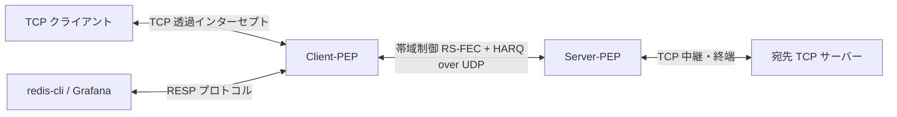

# TCP-PEP-GO ナローバンド・無線アドホック回線向け 動的適応FEC & ハイブリッドARQ アクセラレータ

[](https://pkg.go.dev/github.com/sh0jitmy/tcp-pep-go)
[](https://github.com/sh0jitmy/tcp-pep-go/actions/workflows/test.yml)
[](https://goreportcard.com/report/github.com/sh0jitmy/tcp-pep-go)
[](https://opensource.org/licenses/Apache-2.0)

TCP-PEP-GOは、高パケットロス、高遅延、および帯域制限のある無線アドホックネットワーク向けに最適化された、Go言語製の高性能 TCP Performance Enhancing Proxy (PEP) デーモンです。

透過的なTCPインターセプト、Reed-Solomon 消失訂正 (RS-FEC)、ハイブリッドARQ (NAKベースの即時再送)、リンク品質フィードバック (LQR) によるパリティ数の動的適応、および各種MAC層のバースト特性に合わせて制御可能なトラフィックシェーパを備えています。

## 主な機能

1. **セッションレス UDP カプセル化**: TCP接続を透過的にインターセプトし、極めて低いオーバーヘッドの構造化されたUDPパケットにカプセル化して対向PEPへ転送します。
2. **動的適応型前方誤り訂正 (Adaptive FEC)**:
   - Reed-Solomon 符号化を用いて、データブロック（$K$ データシャード ＋ $M$ パリティシャード）を生成します。
   - 回線品質がクリーン（ロス率 0%）な場合は、パリティ数 $M$ を自動的に `0` まで削減し、カプセル化による冗長オーバーヘッドを完全に排除します。
   - パケットロスが検出されると、品質フィードバックに基づいてパリティ数 $M$ を自動的に上限値まで引き上げ、FEC修復能力を高めます。
3. **ハイブリッド ARQ (HARQ)**:
   - 受信側でパケット抜けを検知すると、TCPのタイムアウトを待つことなく、即時に該当シーケンス番号に対する NAK 再送要求を送信側に返送し、即時補填を行います。
4. **トークンバケットトラフィックシェーパ**: パケットのバースト送信を抑制・平滑化し、物理無線リンクのキュー溢れによる遅延暴発や擬似ドロップを防ぎます。
5. **動的ルーティング & SIGHUP リロード**: 対向PEPへのマッピング（IPアドレスやCIDRサブネット）を YAML 形式で管理し、`SIGHUP` シグナルを受信することで無停止で設定を動的リロードできます。
6. **内蔵 Redis モニタリングサーバー**: デーモン内に Redis プロトコル (RESP) 互換のインメモリサーバーを内蔵しています。外部のRedisデータベースをデプロイ・管理することなく、`redis-cli` などの標準ツールを用いてリアルタイムのセッション統計やパリティ数、通信量を直接クエリで取得できます。

---

## アーキテクチャ概要



---

## インストールとビルド

### 動作環境
- Go 1.25 以上

### ビルド手順
`Makefile` が提供されており、ビルドやテストが容易に実行できます。

```bash
# デーモンのビルド
make build

# ユニットテストおよび E2E 結合テストの実行
make test
```

### 静的解析と脆弱性チェック
```bash
# golangci-lint の実行
make lintcheck

# govulncheck 脆弱性スキャン
make vulncheck
```

---

## 設定ファイル

クライアントモードでは、宛先TCPアドレスと転送先Server-PEPの対応表を `routes.yaml` に定義します。

```yaml
routes:
  # 特定のホストのルーティング
  - original_dst: "192.168.1.100:80"
    server_pep: "10.0.0.2:20000"
  
  # サブネットマスクによるルーティング
  - original_dst: "172.16.0.0/16"
    server_pep: "10.0.0.3:20000"
```

このルーティング設定は、プロキシ接続を維持したまま、以下のシグナル送信により無停止で動的ホットリロードが可能です。
```bash
kill -HUP <TCP_PEP_DAEMONのプロセスID>
```

---

## 起動方法

### 1. Server-PEP モード (宛先サーバー側)
宛先サーバーの近くのホストで起動します：
```bash
./tcp-pep-daemon \
  -mode server \
  -listen :20000 \
  -mtu 1200 \
  -bandwidth 128000 \
  -fec-k 5 \
  -fec-m 2
```

### 2. Client-PEP モード (クライアント側)
TCPトラフィックを透過的にインターセプトするホストで起動します：
```bash
./tcp-pep-daemon \
  -mode client \
  -listen :10080 \
  -routes routes.yaml \
  -mtu 1200 \
  -bandwidth 128000 \
  -fec-k 5 \
  -fec-m 2 \
  -redis-addr :6379
```

---

## 内蔵 Redis インターフェースによるリアルタイムモニタリング

Client-PEP は内蔵の軽量 Redis 互換サーバー（デフォルトポート `:6379` または `-redis-addr` で指定）を起動します。

`redis-cli` を用いて、稼働中のセッションの統計、適応 FEC の状態、および送受信ネットワーク流量をリアルタイムにクエリできます。

### 1. アクティブなストリームID一覧の取得
```bash
$ redis-cli SMEMBERS tcp-pep:active_streams
1) "1"
2) "2"
```

### 2. セッション統計情報の詳細取得
```bash
$ redis-cli HGETALL tcp-pep:session:1
 1) "stream_id"
 2) "1"
 3) "mode"
 4) "client"
 5) "target_addr"
 6) "127.0.0.1:8080"
 7) "cur_m"               # 現在の適応 FEC パリティ数 M
 8) "0"
 9) "fec_k"
10) "5"
11) "fec_m"
12) "2"
13) "tx_bytes"            # 累積送信バイト数 (UDPレベル)
14) "109840"
15) "rx_bytes"            # 累積受信バイト数 (UDPレベル)
16) "109840"
17) "tx_packets"
18) "110"
19) "rx_packets"
20) "110"
21) "losses"              # 直近のLQRで対向から報告されたロス数
22) "0"
23) "consecutive_ok"      # 連続して消失のなかったブロック数
24) "12"
25) "last_active"
26) "2026-05-23T22:31:49Z"
```

### 3. キー一覧の確認
```bash
$ redis-cli KEYS "*"
1) "tcp-pep:active_streams"
2) "tcp-pep:session:1"
```

---

## ライセンス

本プロジェクトは Apache License, Version 2.0 の下で提供されています。詳細は [LICENSE](file:///Users/shjtmy/gravity/tcp-pep/LICENSE) を参照してください。
