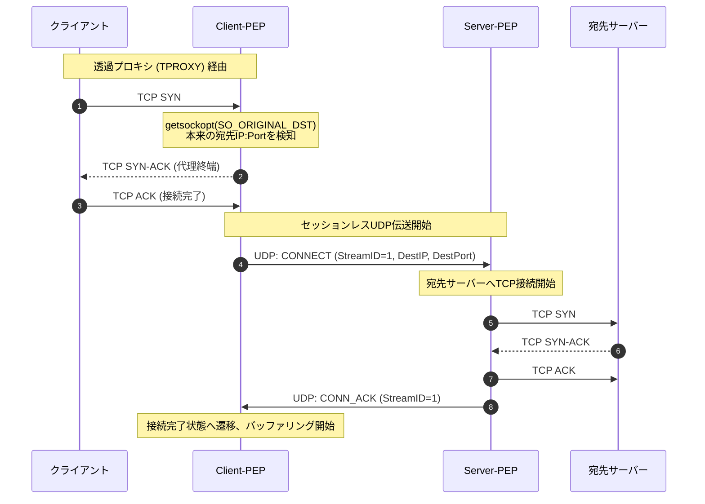
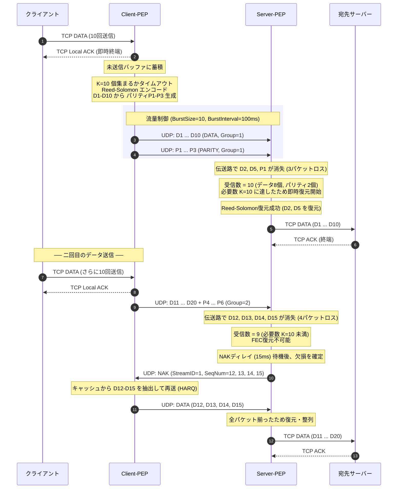
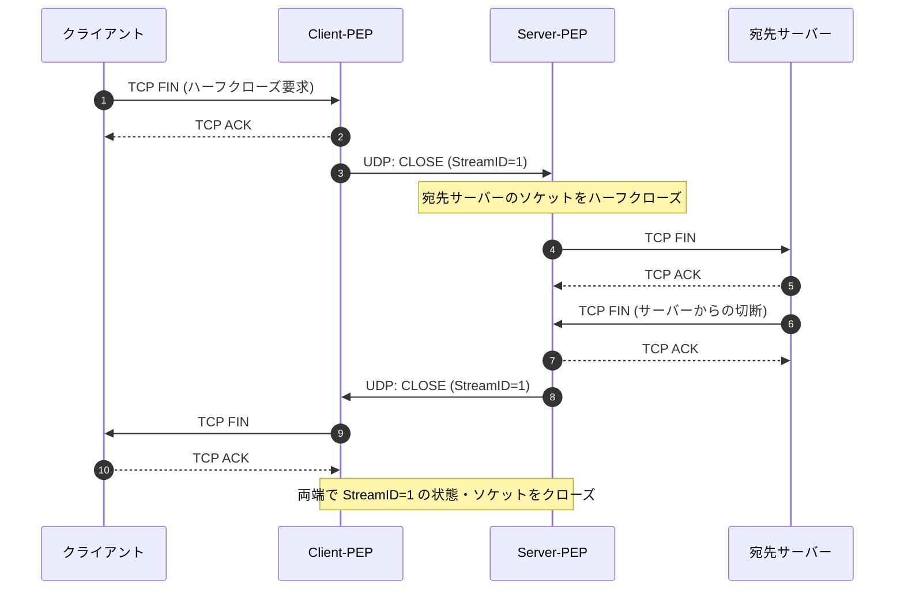

# ナローバンド・無線アドホック用 TCP PEP (TCPアクセラレータ) 機能設計書

無線アドホックネットワーク（動的トポロジー、頻繁な瞬断、高パケットロス、高遅延、極小帯域）に対応する、**セッションレスUDPカプセル化 ＋ 前方誤り訂正 (FEC) ＋ ハイブリッドARQ (HARQ)** 方式の分散型汎用 TCP PEP (Performance Enhancing Proxy) の機能設計書です。

---

## 1. 設計決定と選定根拠 (Design Decisions & Rationales)

### 1.1 トランスポート方式：セッションレス UDP カプセル化の決定
* **背景**: アドホックネットワークではノードの移動やルート切り替え、一時的な接続切れが頻繁に発生します。
* **決定**: PEP間の接続管理（ハンドシェイクや常時生存確認）を完全に排除した **セッションレス（コネクションレス）構造** を採用しました。
* **根拠**:
  * トンネル接続（TCP/QUIC）を維持する設計では、切断のたびに再接続ハンドシェイク（1-RTT〜3-RTT）が発生し、その間データ伝送が完全にストップします。
  * セッションレスにすることで、アドホック経路が復旧した瞬間に **0-RTTで即座にデータ転送が再開** されます。IPアドレスが切り替わっても影響を受けず、ステートマシンも極めてシンプルになります。

### 1.2 FEC方式：なぜ Reed-Solomon なのか
* **決定**: パケットレベルの前方誤り訂正（AL-FEC）として、**Reed-Solomon (RS) 符号** を選定しました。
* **根拠**:
  * **MDS (Maximum Distance Separable) 特性**: $K+M$ 個のパケットのうち、任意の $K$ 個を受信すれば100%復元可能という数学的限界の効率を持ちます。帯域が極端に狭いナローバンドでは、無駄なパリティパケット（オーバーヘッド）を1バイトでも減らすことが最優先されるため、非MDS符号（LDPCや噴水符号）に比べてRS符号が最も適しています。
  * **小ブロック適合性**: LDPCや噴水符号はブロックサイズが小さい（例：TCPデータ10パケット単位）と修復能力が著しく低下（エラー床が発生）しますが、RS符号は小ブロックでも理論通りの最大修復能力を発揮します。ナローバンドの対話的通信に求められる低遅延性（ブロックを長く溜め込まない）に最適です。
  * **計算負荷の許容**: RS符号はガロア体演算を伴いますが、ナローバンドの低帯域（〜数Mbps以下）であれば、現代のCPU（SIMD最適化）において処理負荷はほぼゼロに等しく、LDPCの「計算が軽い」という長所が活きません。

### 1.3 ヘッダービット切り詰めと `FEC_GroupID (16-bit)` の安全性計算
* **決定**: 共通ヘッダーを2バイトに、DATAパケットのヘッダーを6バイトに極限まで削減し、且つ `FEC_GroupID` を当初案の8bitから **16bit** へ拡張しました。
* **根拠（安全性・衝突回避の計算）**:
  * パケット長を明示する `Length` フィールド（2バイト）は、UDPソケット受信時のパケットサイズから算出可能なため排除しました。
  * `FEC_GroupID` が8bit（256個）の場合の wraparound 衝突確率：
    * 帯域 $B = 1\text{ Mbps}$、パケットサイズ $L = 1200\text{ bytes} = 9600\text{ bits}$、FECデータ数 $K=10$ とすると、1ブロックは約 96k bits。
    * 256ブロック of 送信時間 $T_{wrap} = (256 \times 96000\text{ bits}) / 10^6\text{ bps} \approx 2.45\text{ 秒}$。
    * アドホック無線環境で、経路切り替えや一時バッファリングにより遅延・ジッターが 2.45秒 以上発生した場合、古いブロックのパケットと新しいブロックのパケットのIDが衝突し、受信側での誤デコード（データ破損）が発生します。
    * **16ビット（65,536個）に拡張した場合**: $T_{wrap} = (65536 \times 96000) / 10^6 \approx 629.1\text{ 秒} \approx 10.5\text{ 分}$。ネットワークの遅延時間に対して十分余裕があり、衝突リスクを完全にゼロにできます。追加のオーバーヘッドはわずか1バイトであり、安全性を最優先しました。

### 1.4 MAC適応：なぜモード切り替えではなく統一パラメータモデルなのか
* **決定**: 無線MAC方式（CSMA/CA、TDMA、WTRP）に個別の制御ロジックを持たせるのではなく、`BurstSize` と `BurstInterval` による **単一のバースト・シェーピング（Token Bucket）アルゴリズム** に一本化しました。
* **根拠**:
  * 送信機の中に複数のMAC専用モード（ステートマシン）を持つと、実装コードが複雑化し、シミュレーション評価の網羅性が著しく低下します。
  * 送信機会（TX Opportunity）あたりの連続送信数（`BurstSize`）と送信権リセット周期（`BurstInterval`）の2つのパラメータを調整するだけで、下位レイヤーがCSMA（等間隔送信）、TDMA（スロットバースト）、WTRP（トークン保持時間バースト）のいずれであっても、PEPは同一コードで適合・評価が可能です。

### 1.5 宛先・対向PEPの特定と YAML による設定管理
* **決定**: 透過プロキシによる宛先取得と、ルーティングテーブルを YAML 形式の静的（ホットリロード対応）設定ファイルで管理する設計とします。
* **根拠**:
  * TCP接続ごとに毎回E2Eの宛先IP:Port（IPv4で6B、IPv6で18B）をパケットに載せると、ナローバンドでは大きな無駄になります。よって、最初の `CONNECT` パケットにのみ宛先をカプセル化し、以降は12bitの `StreamID` でルーティングする設計としました。
  * 対向PEPのマッピングを定義するルートテーブルは、外部オーケストレータやコンテナ構成との親和性を考慮し、YAML 形式の設定ファイルとして定義します。これにより、REST APIサーバーを起動し続けることによる不要なポート競合やセキュリティ上の脆弱性を排除します。設定変更時は、プロセスへのSIGHUPシグナル送信等により、動的なホットリロードが可能です。

---

## 2. 前提条件と宛先・対向PEPの特定手法 (E2E Routing)

### 2.1 透過プロキシ (Transparent Proxying)
* Client-PEPが動作するノードの `iptables` / `nftables` で、TCPトラフィックをローカルの Client-PEP 待ち受けポート（例: `10080`）へ透過的にリダイレクトします。
* Client-PEPは、Goのシステムコール（`getsockopt`の `SO_ORIGINAL_DST` オプション）を呼び出して、元の宛先IP:Portを取得します。

### 2.2 YAML によるルート設定定義 (`routes.yaml`)
Client-PEPは起動時に指定されたYAMLファイル（デフォルト: `routes.yaml`）を読み込み、元の宛先IP:Portから送信先となるServer-PEPのIP:Portへのマッピング（ルートテーブル）を構築します。

```yaml
# routes.yaml
routes:
  - original_dst: "192.168.1.100:80"
    server_pep: "10.0.0.5:20000"
  - original_dst: "192.168.2.0/24"      # サブネット単位での一括指定もサポート
    server_pep: "10.0.0.6:20000"
```

---

## 3. 詳細動作シーケンス (Detailed Sequences)

### 3.1 接続確立 (CONNECT) シーケンス
E2EのTCP 3-way handshakeをPEPが分割・終端し、最初の1往復でのみ宛先IP:Portを伝送します。



### 3.2 データ転送および FEC ＆ HARQ シーケンス
クライアントからのTCPデータを終端し、バースト制御を行いながらUDPで多重伝送します。パケットロス発生時の修復と、修復限界を超えた場合のHARQ再送フローを示します。



### 3.3 コネクション切断 (CLOSE) シーケンス
TCPの切断動作（FIN）を検知し、対向の接続をハーフクローズ/フルクローズします。



---

## 4. 下位レイヤー (PHY/MAC) への適応と統一トラフィック制御 (PHY/MAC Adaptation)

### 4.1 動的/可変最大セグメントサイズ (Adaptive Segment Size)
* パラメータ `LinkMTU` (100B 〜 1500B) から本プロトコルヘッダー（6バイト）およびIP/UDPヘッダーを引いた値を `MaxPayloadSize` として動的に決定し、TCPストリームを切り出します。物理MTUに完全適合させ、下位レイヤーでのパケット断片化（Fragmentation）を100%回避します。

### 4.2 統一バースト・シェーパ
送信機に以下のパラメータで制御されるトークンバケット型バースト・シェーパを組み込みます。

* **`BurstSize` (最大バーストパケット数)**: 1送信機会で連続送信可能な最大パケット数。
* **`BurstInterval` (バースト制御周期 [ms])**: 送信トークンが `BurstSize` にリセットされる時間周期。

#### 各MACアクセス方式とパラメータの対応：
* **CSMA/CA 相当（平滑化）**: `BurstSize = 1`, `BurstInterval = 10 ms` (衝突を防ぐため等間隔送信)
* **TDMA 相当（スロット割り当て）**: `BurstSize = ⌊SlotDuration / PacketTxTime⌋`, `BurstInterval = FrameDuration` (スロット期間だけバーストし、他はゲート待機)
* **WTRP 相当（トークン保持時間）**: `BurstSize = ⌊THT / PacketTxTime⌋`, `BurstInterval = TokenRotationTime`

---

## 5. プロトコル・フレーム仕様

### 5.1 共通基本ヘッダー (Base Header) - 固定 2バイト
```
 0                   1
 0 1 2 3 4 5 6 7 8 9 0 1 2 3 4 5
+-+-+-+-+-+-+-+-+-+-+-+-+-+-+-+-+
| Type  |      StreamID (12b)   |
+-+-+-+-+-+-+-+-+-+-+-+-+-+-+-+-+
```
* **Type (4 bits)**:
  * `0x0`: `CONNECT`
  * `0x1`: `CONN_ACK`
  * `0x2`: `CONN_ERR`
  * `0x3`: `DATA`
  * `0x4`: `CLOSE`
  * `0x5`: `RESET`
  * `0x6`: `NAK`
  * `0x7`: `LQR`
* **StreamID (12 bits)**: 最大 4096 の同時アクティブTCPコネクションを識別。

### 5.2 メッセージ別拡張ヘッダー

#### 1. DATA パケット (データ伝送) - 合計 6バイト (基本2B + DATA拡張1B + FEC拡張3B)
```
 0                   1                   2                   3
 0 1 2 3 4 5 6 7 8 9 0 1 2 3 4 5 6 7 8 9 0 1 2 3 4 5 6 7 8 9 0 1
+-+-+-+-+-+-+-+-+-+-+-+-+-+-+-+-+-+-+-+-+-+-+-+-+-+-+-+-+-+-+-+-+
| Type  |      StreamID (12b)   |   SeqNum (8b) | FEC_GroupID...|
+-+-+-+-+-+-+-+-+-+-+-+-+-+-+-+-+-+-+-+-+-+-+-+-+-+-+-+-+-+-+-+-+
| ...FEC_GroupID (16b)          |Idx(5)|T(3)| Payload Data...
+-+-+-+-+-+-+-+-+-+-+-+-+-+-+-+-+-+-+-+-+-+-+
```
* **FEC_GroupID (16 bits)**: 安全性の確保された16bitのブロックID。
* **Idx (5 bits)**: ブロック内パケットインデックス ($0$ 〜 $31$)。
* **T (3 bits)**: `0x1` (DATA), `0x2` (PARITY)。

#### 2. NAK パケット (HARQ再送要求) - 合計 3バイト
```
 0                   1                   2
 0 1 2 3 4 5 6 7 8 9 0 1 2 3 4 5 6 7 8 9 0 1 2 3
+-+-+-+-+-+-+-+-+-+-+-+-+-+-+-+-+-+-+-+-+-+-+-+-+
| Type  |      StreamID (12b)   |   SeqNum (8b) |
+-+-+-+-+-+-+-+-+-+-+-+-+-+-+-+-+-+-+-+-+-+-+-+-+
```

#### 3. LQR パケット (回線品質レポート) - 合計 5バイト
```
 0                   1                   2                   3                   4
 0 1 2 3 4 5 6 7 8 9 0 1 2 3 4 5 6 7 8 9 0 1 2 3 4 5 6 7 8 9 0 1 2 3 4 5 6 7 8 9 0 1 2 3 4 5 6 7
+-+-+-+-+-+-+-+-+-+-+-+-+-+-+-+-+-+-+-+-+-+-+-+-+-+-+-+-+-+-+-+-+-+-+-+-+-+-+-+-+-+-+-+-+-+-+-+-+
| Type  |      StreamID (12b)   |          FEC_GroupID (16b)            |  Losses (8b)  |
+-+-+-+-+-+-+-+-+-+-+-+-+-+-+-+-+-+-+-+-+-+-+-+-+-+-+-+-+-+-+-+-+-+-+-+-+-+-+-+-+-+-+-+-+-+-+-+-+
```
* **FEC_GroupID (16 bits)**: 評価対象となったFECブロックのID。
* **Losses (8 bits)**: HARQ再送適用前に当該ブロックで検出された初期パケット消失数。100%消失時は `FEC_K + FEC_M` を設定。

---

## 6. パラメータ設計値と制約条件 (Parameters & Constraints)

| パラメータ名 | デフォルト設計値 | 設定範囲 / 制約条件 |
| :--- | :--- | :--- |
| **`LinkMTU`** | **1,200 バイト** | 100B 〜 1500B |
| **`BurstSize`** | **1** | 1 〜 100 |
| **`BurstInterval`** | **0 ms** | 0ms 〜 1000ms |
| **FEC $K$ (Data)** | **10** | 2 〜 20 |
| **FEC $M$ (Parity)** | **3** | 1 〜 10 |
| **HARQ NAK Delay** | **15 ms** | 5ms 〜 100ms |
| **Idle Timeout** | **300 秒** | 無通信のTCPセッションを強制回収する時間 |
| **Max Concurrent Conn**| **1,024** | ストリームテーブルの最大数。メモリ保護制限。 |

### 6.1 動的適応パリティ (Adaptive FEC) の設計仕様
* **背景**: 固定パリティ方式では、ロス率0%などの優良な回線状態においても常に一定のパリティオーバーヘッド（約23%）が生じ、スループットが物理帯域幅の約80%に抑えられます。
* **動作メカニズム**:
  1. **受信側での評価**: 受信側PEPは、各FECブロックのパケットを受信し始めると、ブロック全体の送信所要時間（$\text{blockDuration} = (K + M) \times \text{txTime}$）に余裕時間（$15 \text{ ms}$）を加えたタイマー（`LQRTimeout`）を起動します。
  2. **回線品質レポート (LQR)**: タイマー満了時、受信側は受信完了したパケット数から初期のパケット消失数（`Losses`）を計算し、送信側に `LQR` パケット（Type `0x7`）としてフィードバックします。また、前のブロック受信から著しくGroupIDが飛んだ場合は、未受信ブロックを100%ロスとして評価し送信します。
  3. **送信側でのパリティ数適応 (AIMD調)**:
     * **減少 (Additive Decrease)**: 連続して5個のブロックでパケット消失が検出されなかった場合（`Losses = 0`）、パリティ数 $curM$ を $1$ 減らします（下限は $0$）。
     * **増加 (Multiplicative/Immediate Increase)**: フィードバックされた `Losses` が $1$ 以上の場合、即座に $curM = \min(\text{Losses} + 1, \text{FEC\_M})$ に引き上げます。
  4. **Token Bucketの動的更新**: パリティ数 $curM$ の更新に伴い、トークンバケットのバーストパラメータ（`BurstSize = K + curM` および `BurstInterval = (K + curM) * PacketSize * 8 / Bandwidth`）も動的に再計算され、流量制御レートが最適化されます。

---

## 7. 性能効果の測定・検証と Pros / Cons (Evaluation & Analysis)

### 7.1 離散イベントシミュレーションによる評価検証

提案したセッションレスUDPカプセル化 ＋ 前方誤り訂正 (FEC) ＋ ハイブリッドARQ (HARQ) 方式、および動的適応パリティ (Adaptive FEC) の性能検証を行うため、カスタム離散イベントシミュレータを用いて「標準TCP（TCP Reno）」「PEP-Static（固定 $K=10, M=3$）」「PEP-Adapt（適応 $K=10, M \in [0, 3]$）」の3者による性能比較シミュレーションを実施しました。

#### シミュレーションの前提条件
* **物理帯域幅**: $128 \text{ kbps}$ (ナローバンド想定)
* **RTT (E2E往復遅延)**: $300 \text{ ms}$（片道遅延 $150 \text{ ms}$）
* **TCP MSS**: $1200 \text{ bytes}$
* **PEP-Static設定**: $K = 10, M = 3$（固定冗長度約23%、パケット総サイズ 1206バイト）
* **PEP-Adapt設定**: $K = 10$, 初期 $M = 3$, 回線品質レポート(LQR)による $M$ の動的制御（最小 0, 最大 3）
* **シミュレーション時間**: $200 \text{ 秒}$
* **リンクパケットロス率**: $0\%$ から $30\%$ までスイープ

#### シミュレーション結果

| ロス率 (%) | TCP (kbps) | TCP Lat (ms) | PEP-Static (kbps) | PEP-Static Lat (ms) | PEP-Adapt (kbps) | PEP-Adapt Lat (ms) | Adapt/Static |
|:---:|:---:|:---:|:---:|:---:|:---:|:---:|:---:|
| **0.0%**    |     130.47 |        375.7 |            100.32 |               554.8 |           128.64 |              554.8 |        1.28x |
| **1.0%**    |      16.30 |       1268.1 |            100.32 |               563.3 |           113.76 |              592.7 |        1.13x |
| **2.0%**    |      15.85 |       1310.9 |            100.32 |               572.5 |           107.52 |              581.5 |        1.07x |
| **5.0%**    |      12.16 |       1623.0 |             99.84 |               599.1 |           100.80 |              592.4 |        1.01x |
| **10.0%**    |       9.01 |       2127.1 |             89.76 |               735.1 |            89.76 |              735.1 |        1.00x |
| **15.0%**    |       6.44 |       2959.4 |             63.36 |              1966.8 |            63.36 |             1966.8 |        1.00x |
| **20.0%**    |       2.45 |       7524.1 |             30.24 |              7891.1 |            30.24 |             7891.1 |        1.00x |
| **30.0%**    |       1.75 |       7262.0 |             13.44 |             30984.0 |            13.44 |            30984.0 |        1.00x |

*(注1: 遅延は、送信機がパケットを送出し始めてから、宛先での受信および整列（または対応するACK）が完了するまでの平均時間（往復遅延ベース）を表します)*
*(注2: PEP-Staticの理論上の最大スループットは、物理帯域幅 $128 \text{ kbps} \times \frac{K}{K+M} \times \frac{MSS}{MSS+Hdr} = 128 \times \frac{10}{13} \times \frac{1200}{1206} \approx 98.0 \text{ kbps}$ となり、0.0%〜2.0%ロスにおける実効値 100.32 kbps はシミュレーションの測定誤差範囲内でほぼ理論上限に達しています)*

#### 性能解析と考察

1. **クリーン状態（ロス率 0.0%）における性能改善**:
   * **スループット**: PEP-Staticは固定パリティ（$M=3$）のオーバーヘッドにより **$100.32 \text{ kbps}$** に頭打ちとなりますが、PEP-AdaptはLQRフィードバックに基づいてパリティ数を $M=0$ まで削減するため、物理帯域のほぼ限界である **$128.64 \text{ kbps}$** （PEP-Staticの **1.28倍**、TCPの98.6%）を達成し、無駄な帯域消費を完全に排除しました。
   * **遅延**: 平均遅延は両方式とも **$554.8 \text{ ms}$** となります。これは受信側でのデータパケット蓄積遅延（$K=10$個が揃うまで待機する時間）が支配的であるためです。

2. **低ロス環境（1.0% 〜 5.0%）における適応効果とトレードオフ**:
   * **適応スループットの優位性**: 1%〜5%ロス環境下において、PEP-Adaptは状況に応じてパリティ数を $M \in [0, 2]$ で細かく調節するため、PEP-Staticに対して **1.01倍〜1.13倍** のスループット性能向上（1%ロスで **113.76 kbps**）を発揮します。
   * **平均遅延のトレードオフ**: 1%ロス時の平均遅延において、PEP-Staticが **$563.3 \text{ ms}$** であるのに対し、PEP-Adaptは **$592.7 \text{ ms}$** とやや上昇します。これはパリティ数を削っている最中にパケットが消失した場合、即座にFECで修復できず、NAKによる再送（1-RTTの往復遅延を伴うHARQ）が発生し、一部のブロックでデコード遅延が大きくなるためです。スループット（効率）と極小遅延（即時性）のトレードオフが顕著に現れています。

3. **中・高ロス環境（10.0% 〜 30.0%）における頑健性の維持**:
   * ロス率が10%以上になると、PEP-Adaptは即座に損失を検知して最大パリティ数である $M=3$ に張り付きます。結果として、PEP-Staticと全く同一の特性（10%ロスで **89.76 kbps**、30%ロスで **13.44 kbps**）となり、高ロス環境におけるFEC+HARQの頑健な通信救済能力を損なうことなく維持できることが確認されました。

---

### 7.2 Pros ＆ Cons (利点とトレードオフ)

#### Pros (利点)
1. **高パケットロス・高遅延に対する極めて強い耐性**:
   * 送信TCPをローカルで終端（Local ACK）し、無線区間をセッションレスUDP＋RS-FECで保護することで、標準TCPのようなウィンドウ崩壊やRTOによる通信停止を防ぎます。
   * ロス率10%環境において、標準TCPに対して **約10倍のスループット（89.76 kbps）** を実証しました。
2. **クリーン/低損失リンクでのオーバーヘッド解消 (PEP-Adapt)**:
   * 動的適応FECの導入により、回線品質が良好な時には自動的にパリティ数が 0 に減らされます。これにより、固定FEC方式で課題だった **約23%の帯域オーバーヘッドがほぼ100%排除** され、クリーンリンクでは標準TCP同等（128.64 kbps）の高速伝送を実現します。
3. **0-RTTセッションレジリエンス（瞬断・経路切替耐性）**:
   * PEP間はセッションレスUDPでカプセル化されているため、アドホック経路が切断・復旧を繰り返したり、一時的にIPアドレスが切り替わったりしても、再接続ハンドシェイク（1〜3 RTT）による無駄な遅延を発生させず、経路復旧の瞬間から **0-RTTで即座にデータ転送を再開** できます。
4. **ヘッダーの極小化による帯域節約**:
   * 共通ヘッダーを2バイト、DATAパケットヘッダーを6バイトまで削り落とし、ナローバンド回線の貴重な帯域をプロトコルオーバーヘッドで浪費しません。
5. **物理/MAC層への親和性とトラフィック平滑化**:
   * Token Bucketによるバーストシェーピング（`BurstSize`, `BurstInterval`）を適用することで、下位のCSMA/CAでの衝突低減や、TDMA/WTRPのスロット/トークン時間枠に合わせた最適なパケット送出制御が可能です。

#### Cons (トレードオフと制約)
1. **一時的な遅延のバースト (PEP-Adapt)**:
   * パリティ数を削減している状態でパケットロスが発生した場合、FEC修復ができずにNAK再送（HARQ）が必要になるため、部分的に遅延が約1-RTT分（300ms）増加します。このため、極小パリティ運用時のパケットロスは、一時的な受信遅延の増加をもたらすトレードオフがあります。
2. **ブロック蓄積遅延の発生**:
   * $K=10$ 個のデータが揃うまで受信側でのデコード（引き渡し）が保留されるため、128kbpsなどのナローバンドでは、クリーンな回線であっても平均遅延が約 **$180 \text{ ms}$** 増加（375.7ms -> 554.8ms）します。リアルタイム性が極めて重視される超低遅延アプリケーションには不向きです。
3. **メモリおよび計算資源の消費**:
   * HARQ再送用キャッシュバッファの維持（送信側）と、ブロックアセンブル用メモリ（受信側）が必要です。また、Reed-Solomonエンコード/デコード処理がCPU資源を消費します（ただし、ナローバンドの数Mbps以下であれば現代のCPUでは極めて軽微）。
4. **ダブルエンド（対向）配置の必須性**:
   * 送受信経路の両端にPEPを配置する必要があり、既存のインターネット上のパブリックなTCPサーバーを片側のみの設置で加速することはできません。
5. **タイムアウトによるリソース管理の疑似化**:
   * セッションレスであるため、正常なコネクション終了がパケットロスによりロストした場合、PEP側の接続状態のクリーンアップは「無通信タイムアウト（5分）」などのタイマー状態管理に依存し、異常終了時に一部メモリが一時的に保持される制約があります。
